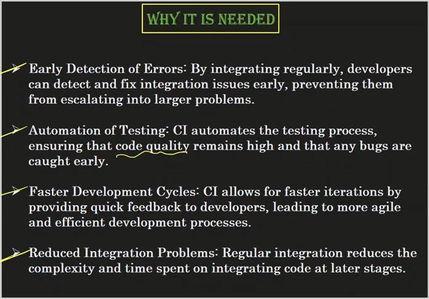
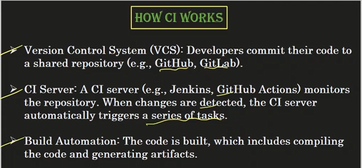
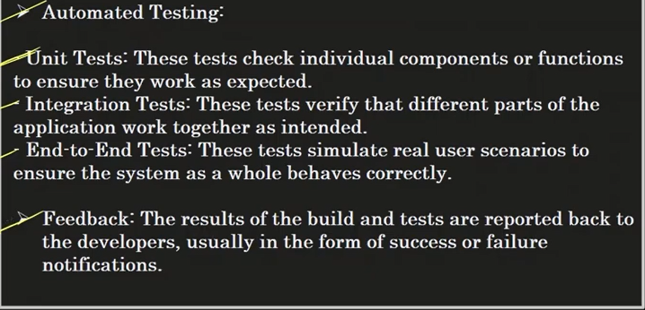
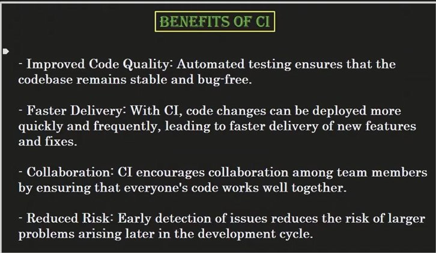

# Tests that can be performed
1) Unit Tests

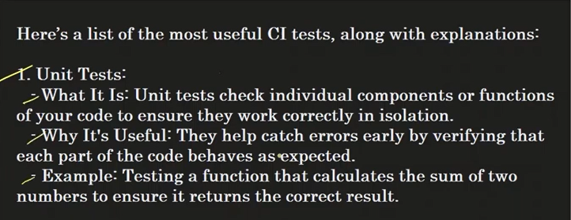
2) Integration Tests

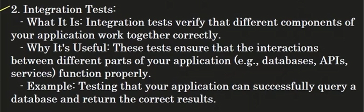
3) End to End Tests

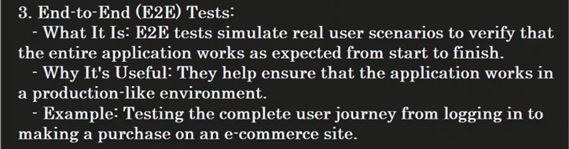
4) Static Code Analysis

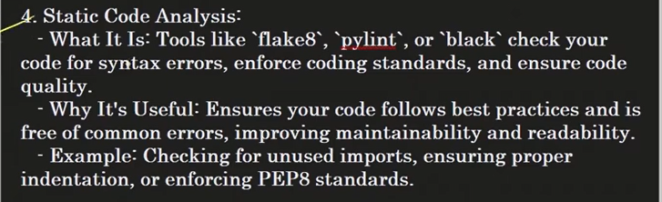
5) Security Tests

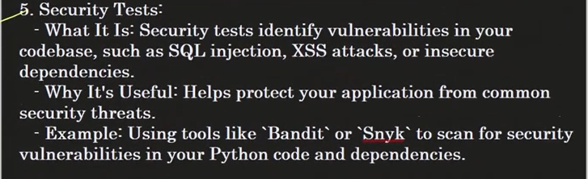
6) Performance Tests

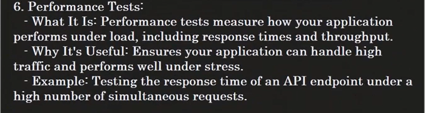
7) Smoke Test

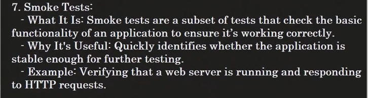
8) Regression Tests

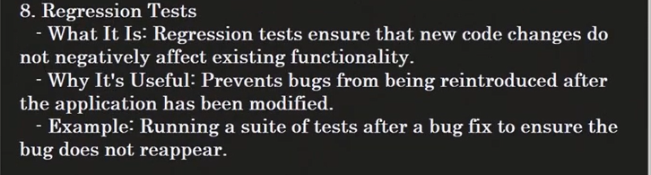
9) Cross Browser/Platform Tests

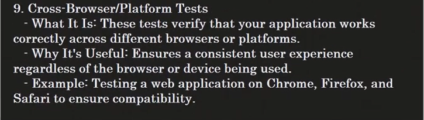

# CI-CD in MLOPS

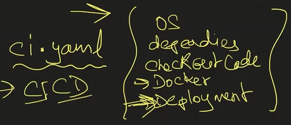